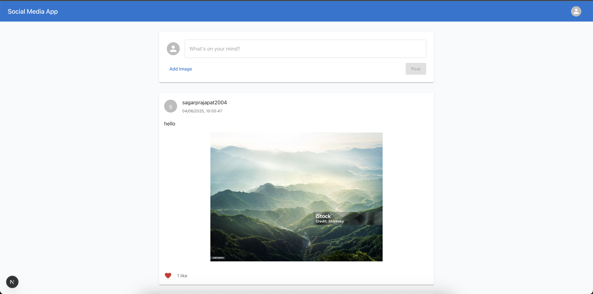
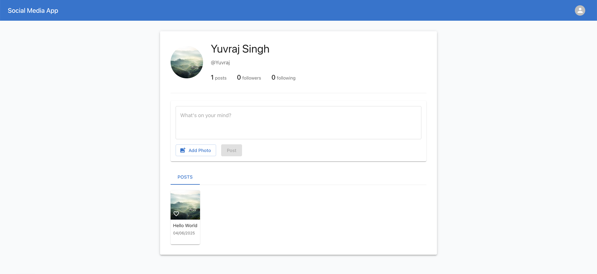
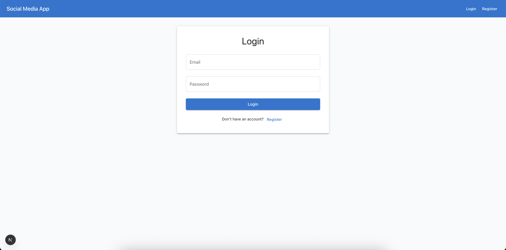
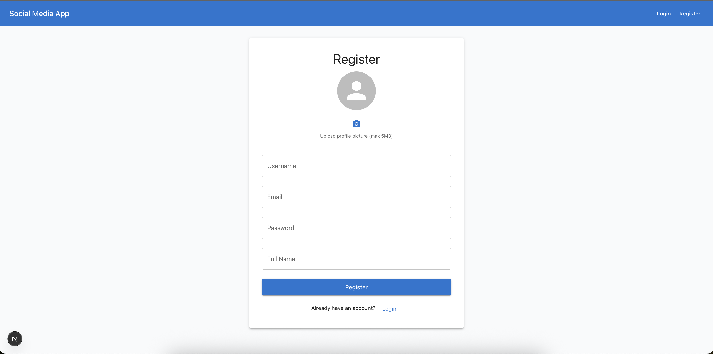

# Social Media Application

A full-stack social media application built with Next.js, Express.js, and MySQL. This application allows users to create accounts, share posts, follow other users, like posts, and interact with the community.

## Features

- 🔐 User Authentication (Register/Login)
- 👤 User Profiles with Profile Images
- 📝 Create Posts with Text and Images
- ❤️ Like/Unlike Posts
- 👥 Follow/Unfollow Users
- 📱 Responsive Design
- 📸 Image Upload Support
- 🔍 User Search
- 📊 Post Feed with Pagination

## Tech Stack

### Frontend
- Next.js 14
- Material-UI (MUI)
- React Hot Toast
- Axios
- React Context API

### Backend
- Express.js
- MySQL
- JWT Authentication
- Multer (File Upload)
- Bcrypt (Password Hashing)

## Prerequisites

Before you begin, ensure you have the following installed:
- Node.js (v14 or higher)
- MySQL Server
- npm or yarn

## Installation

1. Clone the repository:
```bash
git clone https://github.com/amarprajapati571/social-media-app.git
cd social-media-app
```

2. Install backend dependencies:
```bash
cd backend
npm install
npm run init-db
npm run dev
```

3. Create a `.env` file in the backend directory:
```env
DB_HOST=localhost
DB_USER=your_mysql_username
DB_PASSWORD=your_mysql_password
DB_NAME=social_media
JWT_SECRET=your_jwt_secret
PORT=3001
```

4. Set up the database:
```sql
CREATE DATABASE social_media;
USE social_media;

CREATE TABLE users (
    id INT PRIMARY KEY AUTO_INCREMENT,
    username VARCHAR(50) UNIQUE NOT NULL,
    email VARCHAR(100) UNIQUE NOT NULL,
    password VARCHAR(255) NOT NULL,
    full_name VARCHAR(100) NOT NULL,
    profile_image VARCHAR(255),
    bio TEXT,
    created_at TIMESTAMP DEFAULT CURRENT_TIMESTAMP
);

CREATE TABLE posts (
    id INT PRIMARY KEY AUTO_INCREMENT,
    user_id INT NOT NULL,
    content TEXT,
    image_url VARCHAR(255),
    created_at TIMESTAMP DEFAULT CURRENT_TIMESTAMP,
    FOREIGN KEY (user_id) REFERENCES users(id) ON DELETE CASCADE
);

CREATE TABLE likes (
    id INT PRIMARY KEY AUTO_INCREMENT,
    user_id INT NOT NULL,
    post_id INT NOT NULL,
    created_at TIMESTAMP DEFAULT CURRENT_TIMESTAMP,
    FOREIGN KEY (user_id) REFERENCES users(id) ON DELETE CASCADE,
    FOREIGN KEY (post_id) REFERENCES posts(id) ON DELETE CASCADE,
    UNIQUE KEY unique_like (user_id, post_id)
);

CREATE TABLE follows (
    id INT PRIMARY KEY AUTO_INCREMENT,
    follower_id INT NOT NULL,
    following_id INT NOT NULL,
    created_at TIMESTAMP DEFAULT CURRENT_TIMESTAMP,
    FOREIGN KEY (follower_id) REFERENCES users(id) ON DELETE CASCADE,
    FOREIGN KEY (following_id) REFERENCES users(id) ON DELETE CASCADE,
    UNIQUE KEY unique_follow (follower_id, following_id)
);
```

5. Install frontend dependencies:
```bash
cd ../frontend
npm install
```

6. Create a `.env.local` file in the frontend directory:
```env
NEXT_PUBLIC_API_URL=http://localhost:3001
```

## Running the Application

1. Start the backend server:
```bash
cd backend
npm start
```

2. Start the frontend development server:
```bash
cd frontend
npm run dev
```

3. Open your browser and navigate to `http://localhost:3000`

## Screenshots

### Home Page

*The main feed showing posts from followed users*

### Profile Page

*User profile showing posts, followers, and following counts*

### Create Post

*Interface for creating new posts with text and image upload*

### Login Page

*User login interface*

### Register Page

*User registration form with profile image upload*

## API Endpoints

### Authentication
- `POST /api/auth/register` - Register a new user
- `POST /api/auth/login` - Login user
- `GET /api/auth/me` - Get current user

### Posts
- `GET /api/posts` - Get all posts (feed)
- `POST /api/posts` - Create a new post
- `POST /api/posts/:id/like` - Like/Unlike a post

### Users
- `GET /api/users/:id` - Get user profile
- `GET /api/users/:id/posts` - Get user's posts
- `POST /api/users/:id/follow` - Follow/Unfollow user

## Contributing

1. Fork the repository
2. Create your feature branch (`git checkout -b feature/AmazingFeature`)
3. Commit your changes (`git commit -m 'Add some AmazingFeature'`)
4. Push to the branch (`git push origin feature/AmazingFeature`)
5. Open a Pull Request

## License

This project is licensed under the MIT License - see the [LICENSE](LICENSE) file for details.

## Acknowledgments

- Material-UI for the beautiful components
- Next.js team for the amazing framework
- Express.js team for the robust backend framework 
